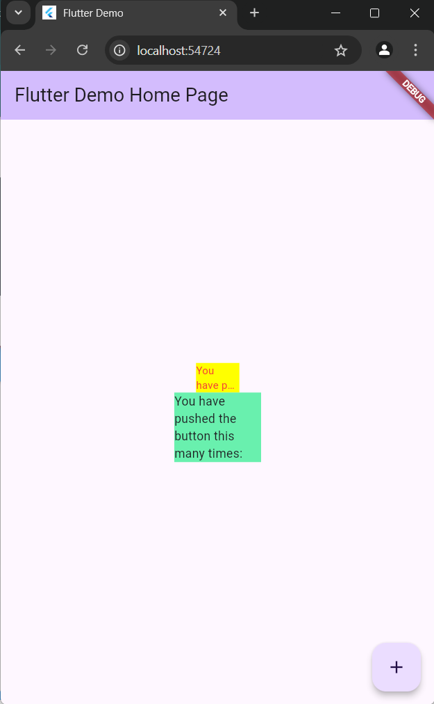

# Laporan praktikum pertemuan 7

## ATHIYAN AQIL MUHAMMAD

## 2241720190

## TI-3H / 04

### PRAKTIKUM

#### LANGKAH 1

membuat projek baru bernama ``` flutter_plugin_pubdev ```

#### LANGKAH 2

Tambahkan plugin auto_size_text menggunakan perintah berikut di terminal
``` flutter pub add auto_size_text ```


#### LANGKAH 3

Buat file baru bernama red_text_widget.dart di dalam folder lib lalu isi kode seperti berikut.

``` dart
import 'package:flutter/material.dart';

class RedTextWidget extends StatelessWidget {
  const RedTextWidget({Key? key}) : super(key: key);

  @override
  Widget build(BuildContext context) {
    return Container();
  }
}
```

#### LANGKAH 4

mengubah ```return container()``` menjadi kode berikut
``` dart
return AutoSizeText(
      text,
      style: const TextStyle(color: Colors.red, fontSize: 14),
      maxLines: 2,
      overflow: TextOverflow.ellipsis,
);
```

#### LANGKAH 5

``` dart
final String text;

const RedTextWidget({Key? key, required this.text}) : super(key: key);
```
- ```final String text;``` mendefinisikan properti ```text```


#### LANGKAH 6

menambahkan kode berikut kedalam children pada ```class _MyHomePageState```

``` dart
Container(
   color: Colors.yellowAccent,
   width: 50,
   child: const RedTextWidget(
             text: 'You have pushed the button this many times:',
          ),
),
Container(
    color: Colors.greenAccent,
    width: 100,
    child: const Text(
           'You have pushed the button this many times:',
          ),
),
```
- Menambahkan Container dalam Column: Dua widget Container telah ditambahkan ke dalam children dari widget Column. Masing-masing Container memiliki properti color, width, dan widget child.

berikut adalah kode lengkap yang saya kerjakan

### class main

``` dart
import 'package:flutter/material.dart';
import 'package:flutter_plugin_pubdev/red_text_widget.dart'; // Gantilah dengan path yang benar


void main() {
  runApp(const MyApp());
}

class MyApp extends StatelessWidget {
  const MyApp({super.key});

  // This widget is the root of your application.
  @override
  Widget build(BuildContext context) {
    return MaterialApp(
      title: 'Flutter Demo',
      theme: ThemeData(
        colorScheme: ColorScheme.fromSeed(seedColor: Colors.deepPurple),
        useMaterial3: true,
      ),
      home: const MyHomePage(title: 'Flutter Demo Home Page'),
    );
  }
}

class MyHomePage extends StatefulWidget {
  const MyHomePage({super.key, required this.title});
  final String title;

  @override
  State<MyHomePage> createState() => _MyHomePageState();
}

class _MyHomePageState extends State<MyHomePage> {

  @override
  Widget build(BuildContext context) {
    return Scaffold(
      appBar: AppBar(
        backgroundColor: Theme.of(context).colorScheme.inversePrimary,
        title: Text(widget.title),
      ),
      body: Center(
        child: Column(
          mainAxisAlignment: MainAxisAlignment.center,
          children: <Widget>[
            Container(
              color: Colors.yellowAccent,
              width: 50,
              child: const RedTextWidget(
                text: 'You have pushed the button this many times:',
              ),
            ),
            Container(
              color: Colors.greenAccent,
              width: 100,
              child: const Text(
                'You have pushed the button this many times:',
              ),
            ),
          ],
        ),
      ),// This trailing comma makes auto-formatting nicer for build methods.
    );
  }
}

```

### class red_text_widget ###

``` dart
import 'package:flutter/material.dart';
import 'package:auto_size_text/auto_size_text.dart';

class RedTextWidget extends StatelessWidget {
  final String text;

const RedTextWidget({Key? key, required this.text}) : super(key: key);

  @override
  Widget build(BuildContext context) {
    return AutoSizeText(
      text,
      style: const TextStyle(color: Colors.red, fontSize: 14),
      maxLines: 2,
      overflow: TextOverflow.ellipsis,
    );
  }
}

```

#### OUTPUT ####
