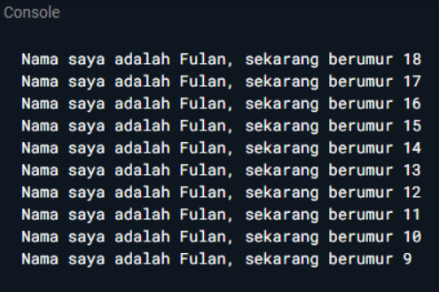
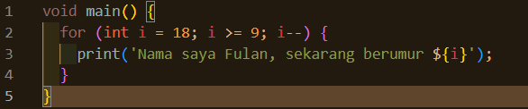
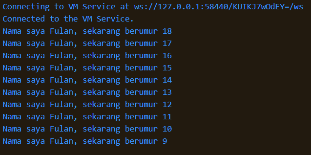

*LAPORAN PRAKTIKUM PERTEMUAN 2*

NAMA: ATHIYAN AQIL MUHAMMAD

NIM: 2241720190

KELAS: TI-3D

1. Modifikasilah kode pada baris 3 di VS Code atau Editor Code favorit Anda berikut ini agar mendapatkan keluaran (output) sesuai yang diminta!
>

hasil yang diminta

kode

output

### tugas no 2 ### 

1. Flutter Dibangun di Atas Dart
Flutter adalah framework yang sepenuhnya ditulis menggunakan Dart. Jadi, seluruh kode yang akan Anda tulis untuk mengembangkan aplikasi di Flutter menggunakan sintaks dan fitur Dart. Memahami Dart akan membantu Anda lebih efisien dalam menulis kode yang tepat dan memahami apa yang terjadi di balik layar dalam Flutter.

2. Struktur dan Sintaksis Dart
Dart memiliki sintaksis dan konsep seperti object-oriented programming (OOP), yang berbeda dari bahasa lain seperti JavaScript atau Python. Memahami konsep dasar Dart seperti class, objects, inheritance, async/await, dan generics akan mempermudah proses pengembangan aplikasi Flutter.

3. Manajemen State dan Asynchronous Programming
Flutter sangat bergantung pada state management dan asynchronous programming. Dart menyediakan fitur bawaan seperti Future, async/await, dan Stream, yang sering digunakan dalam Flutter untuk menangani panggilan API, rendering UI secara asinkron, dan aliran data. Pemahaman mendalam tentang fitur ini penting untuk mengelola interaksi aplikasi dengan backend dan UI yang responsif.

4. Hot Reload dan Hot Restart
Dart dirancang untuk bekerja optimal dengan fitur hot reload dan hot restart di Flutter. Memahami bagaimana Dart menangani perubahan state atau modifikasi kode secara dinamis akan membantu dalam proses pengembangan dan debugging yang lebih cepat.

5. Custom Widget Development
Di Flutter, UI dibuat dengan widget, yang pada dasarnya adalah class Dart. Memahami konsep OOP di Dart seperti pewarisan (inheritance), polimorfisme, dan komposisi akan membantu Anda dalam membangun widget yang lebih kompleks, reusable, dan terstruktur.

6. Perfomansi
Dart mendukung just-in-time (JIT) dan ahead-of-time (AOT) compilation, yang memungkinkan aplikasi Flutter memiliki performa yang tinggi di berbagai platform. Memahami bagaimana Dart dikompilasi dan bekerja di bawah kap sangat membantu dalam mengoptimalkan kinerja aplikasi yang Anda buat.

7. Ekosistem Dart
Dart memiliki banyak library dan package yang mendukung pengembangan aplikasi, seperti pengelolaan state, networking, animasi, dan lainnya. Menguasai cara kerja package Dart, cara menambahkannya ke proyek Flutter, serta memanfaatkan library bawaan akan mempercepat dan memudahkan pengembangan.

8. Pengelolaan Memory dan Garbage Collection
Memahami bagaimana Dart mengelola memori dan garbage collection akan membantu Anda menulis kode yang lebih efisien dan menghindari kebocoran memori yang dapat mempengaruhi performa aplikasi.

### tugas no 3 ###

1. Persiapan Awal

**Instalasi Flutter SDK:** Pastikan Flutter SDK terinstal dan dikonfigurasi dengan benar di lingkungan pengembangan.
Set Up IDE: Gunakan IDE yang mendukung Flutter seperti Visual Studio Code atau Android Studio, dengan plugin Flutter dan Dart terpasang.

**Konfigurasi Emulator atau Device:** Siapkan emulator Android/iOS atau gunakan perangkat fisik untuk pengujian.

2. Desain UI/UX

**Component-based UI:** Manfaatkan widget Flutter yang reusable untuk membangun antarmuka pengguna secara modular dan terstruktur.
Responsive Design: Pastikan desain aplikasi responsif dan mendukung berbagai ukuran layar.

**Theming:** Gunakan sistem tema (ThemeData) untuk konsistensi tampilan aplikasi, seperti warna, font, dan gaya komponen.

**Navigasi:** Implementasikan sistem navigasi menggunakan Navigator untuk perpindahan halaman (route management).
Arsitektur Aplikasi

**State Management:** Pilih metode manajemen state yang sesuai seperti Provider, Riverpod, Bloc, atau GetX untuk mengelola data aplikasi.

**Separation of Concerns:** Pisahkan logika bisnis dan presentasi dengan mengikuti prinsip clean architecture atau MVVM.
Dependency Injection: Gunakan package seperti get_it atau provider untuk mengelola dependensi dengan efisien.
Pengelolaan Data

**Backend Integration:** Integrasikan aplikasi dengan backend menggunakan API REST atau GraphQL.

**Local Database:** Manfaatkan solusi penyimpanan lokal seperti SQLite (melalui package sqflite) atau Hive untuk menyimpan data lokal.

**Offline Support:** Pastikan aplikasi dapat berfungsi offline dengan menyinkronkan data saat online kembali.
Testing

**Widget Testing:** Lakukan pengujian komponen UI secara individual dengan Flutter's Widget Testing.

**Integration Testing:** Uji alur aplikasi secara end-to-end untuk memastikan semua komponen berfungsi dengan baik secara keseluruhan.

**Unit Testing:** Lakukan pengujian unit untuk logika bisnis yang ada di dalam aplikasi.
Optimisasi Kinerja

**Lazy Loading:** Terapkan lazy loading untuk mengoptimalkan waktu muat konten yang berat seperti gambar atau data list.

**Asynchronous Programming:** Manfaatkan fitur async/await dan FutureBuilder untuk menangani proses asinkron seperti panggilan API atau akses database.

**Optimize Image and Asset:** Gunakan gambar dan aset dengan ukuran yang sesuai dan format yang teroptimasi, seperti menggunakan WebP atau SVG.
Deployment dan CI/CD

**Cross-platform Build:** Pastikan aplikasi dibangun untuk kedua platform, Android dan iOS, dengan penyesuaian yang minimal.

**Continuous Integration/Delivery (CI/CD):** Siapkan pipeline CI/CD dengan tools seperti GitHub Actions atau Bitrise untuk otomatisasi build dan pengujian.

**Play Store dan App Store Deployment:** Ikuti proses pengunggahan aplikasi ke Google Play Store dan Apple App Store, serta kelola sertifikat dan konfigurasi keamanannya.
Paket dan Plugin

**Third-party Packages:** Manfaatkan paket Flutter dan Dart dari pub.dev untuk mempercepat pengembangan fitur tertentu seperti autentikasi, pembayaran, dan integrasi media sosial.

**Custom Plugin:** Jika perlu, buat plugin kustom untuk mengakses fitur native yang tidak tersedia di Flutter.